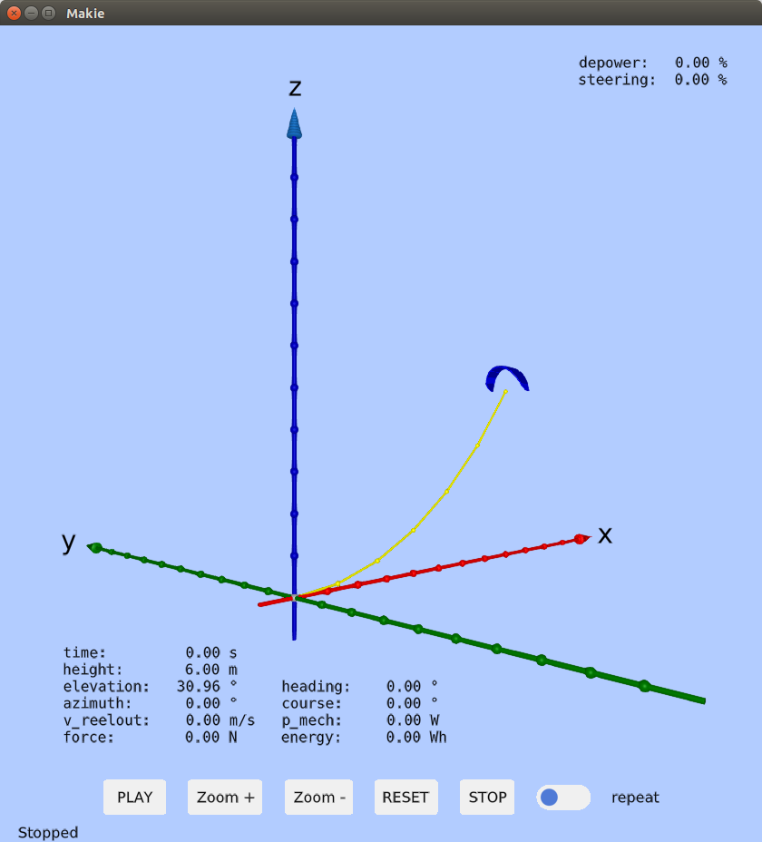
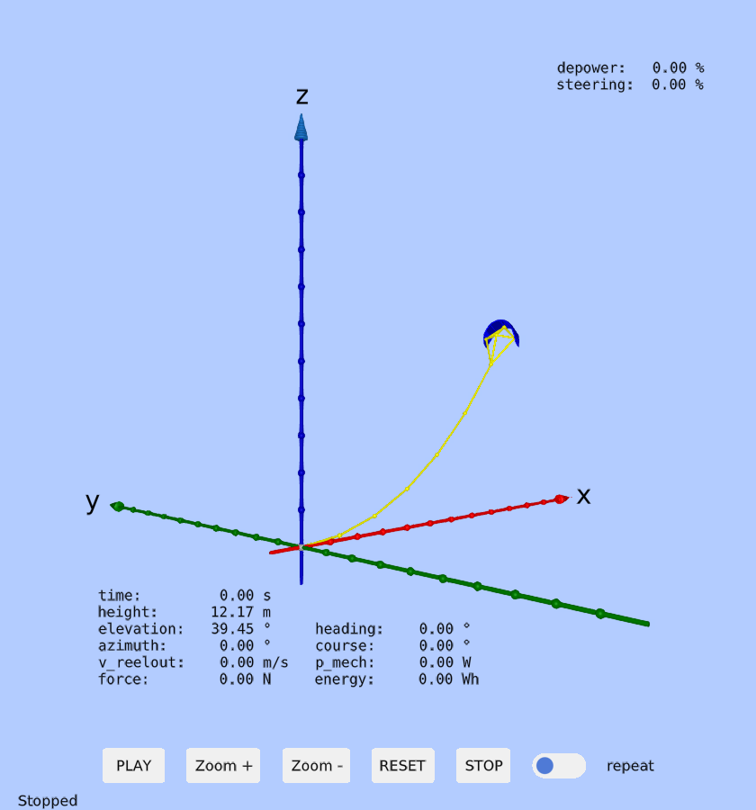

# KiteViewers
[](https://github.com/aenarete/KiteViewers.jl/actions/workflows/CI.yml?query=branch%3Amain)
[](https://codecov.io/gh/aenarete/KiteViewers.jl)

This package provides different kind of 2D and 3D viewers for kite power system.

## Exported types
Viewer3D

Usage:
```julia
show_kite=true
viewer=Viewer3D(show_kite)
```

## Exported functions
update_points(pos, segments, scale=1.0, rel_time = 0.0, force=0.0; orient=nothing, scale_kite=3.5)

## Examples
```julia
using KiteViewers
viewer=Viewer3D(true);
```

After some time a window with the 3D view of a kite power system should pop up.
If you keep the window open and execute the following code:

```julia
using KiteUtils
segments=6
state=demo_state(segments+1)
update_points(state.pos, segments, orient=state.orient)
```

you should see a kite on a tether.
<p align="center"></p>

The same example, but using the 4 point kite model:

```julia
using KiteViewers, KiteUtils
viewer=Viewer3D(false);
segments=6
state=demo_state_4p(segments+1)
update_points(state.pos, segments, kite_scale=0.5)
```
<p align="center"></p>

## See also
- [Research Fechner](https://research.tudelft.nl/en/publications/?search=Uwe+Fechner&pageSize=50&ordering=rating&descending=true) for the scientic background of this code
- The application [KiteViewer](https://github.com/ufechner7/KiteViewer)
- the package [KiteUtils](https://github.com/ufechner7/KiteUtils.jl)
- the package [KitePodModels](https://github.com/aenarete/KitePodModels.jl)
- the package [KiteModels](https://github.com/ufechner7/KiteModels.jl)
- the package [KitePodModels](https://github.com/aenarete/KiteControllers.jl)