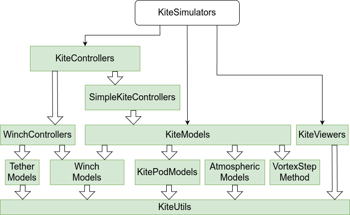

# KiteViewers
[](https://github.com/aenarete/KiteViewers.jl/actions/workflows/CI.yml?query=branch%3Amain)
[](https://codecov.io/gh/aenarete/KiteViewers.jl)

This package provides different kind of 2D and 3D viewers for kite power system.

It is part of Julia Kite Power Tools, which consist of the following packages:
<p align="center"></p>

## Installation
Download [Julia 1.6](http://www.julialang.org) or later, if you haven't already.
```julia
using Pkg
pkg"add KiteViewers"
``` 
at the Julia prompt. You can run the unit tests with the command:
```julia
pkg"test KiteViewers"
```
This package should work on Linux, Windows and Mac. If you find a bug, please file an issue.

## Exported types
```julia
Viewer3D
AbstractKiteViewer
AKV
```
AKV is just the short form of AbstractKiteViewer, Viewer3D the first implementation of it.

Usage:
```julia
show_kite=true
viewer=Viewer3D(show_kite)
```

## Exported functions
```julia
clear_viewer(kv::AKV)
update_system(kv::AKV, state::SysState; scale=1.0, kite_scale=3.5)
save_png(kv::AKV; filename="video", index = 1)
```

## Examples
```julia
using KiteViewers
viewer=Viewer3D(true);
```

After some time a window with the 3D view of a kite power system should pop up.
If you keep the window open and execute the following code:

```julia
using KiteUtils
segments=6
state=demo_state(segments+1)
update_system(viewer, state)
```

you should see a kite on a tether.
<p align="center"></p>

The same example, but using the 4 point kite model:

```julia
using KiteViewers, KiteUtils
viewer=Viewer3D(true);
segments=6
state=demo_state_4p(segments+1)
update_system(viewer, state, kite_scale=0.25)
```
<p align="center"></p>

## Advanced usage
If you have git and bash installed, you can also check out this repository directly:
```
mkdir repos
cd repos
git clone https://github.com/aenarete/KiteViewers.jl.git
cd KiteViewers.jl
```
Then you can build a customer system image which will save a lot of time later:
```
cd bin
./create_sys_image --update
cd ..
```
This takes about 10 min and compiles all the packages that are used. If you now
launch Julia with the command:
```
./bin/run_julia
```
this image is used.
You can now run the examples, e.g.
```
include("examples/depower_simple.jl")
```
which runs a 50s simulation with 8 times time lapse and shows the git depowering
in two steps in the 3D viewer. If you have a joystick connected you can also run
```
include("examples/joystick.jl")
```
The x axis of the Joystick controls steering, y-axis depowering and z-axis the
reel-in and reel-out of the winch.

## See also
- [Research Fechner](https://research.tudelft.nl/en/publications/?search=Uwe+Fechner&pageSize=50&ordering=rating&descending=true) for the scientic background of this code
- The application [KiteViewer](https://github.com/ufechner7/KiteViewer)
- the packages [KiteModels](https://github.com/ufechner7/KiteModels.jl) and [WinchModels](https://github.com/aenarete/WinchModels.jl) and [KitePodModels](https://github.com/aenarete/KitePodModels.jl) and [AtmosphericModels](https://github.com/aenarete/AtmosphericModels.jl)
- the package [KiteUtils](https://github.com/ufechner7/KiteUtils.jl) and [KiteControllers](https://github.com/aenarete/KiteControllers.jl)